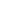

#  Custom Emoji
Custom emojis for OSRS.

## Getting Started

The plugin does not come with built-in emojis. You have a few options:
- Use the built-in GitHub downloader to fetch emoji packs directly (see [GitHub Integration](#-github-integration) below)
- Manually download from a known repository on github and install to your emojis folder

Known repositories:
- `TheLouisHong/custom-emoji-repository` - Has a good baseline of commonly used static emoji. [[link](https://github.com/TheLouisHong/custom-emoji-repository/)]
- `mooncord-emojis/emojis`  - Has a ton of (1000+) emoji both animated and static. Great option if you aren't picky about what emoji you want to see. [[link](https://github.com/mooncord-emojis/emojis/)]

## Features

### Emoji
**The filename becomes the trigger for the emoji.** For example, `woow.png` means typing `woow` in-game will display that image.

- **Supported formats:** `.png`, `.jpg`, `.gif`
- **Location:** `.runelite/emojis/`

You can organize emoji in subfolders for easier management.

#### Animated Emoji
GIF files are fully supported with frame-by-frame animation:
- Animations play in chat messages and above player heads
- Original GIF frame timing is preserved (probably)

### Sidebar Panel
An explorer-style emoji browser in the RuneLite sidebar that allows the user to configure settings for individual emoji:

#### Header Buttons:
-  **Settings** - Open plugin configuration
-  **Github** - Opens a browser page to this repository
-  **Folder** - Shows the `~/.runelite/emojis` folder in a file explorer window

#### Navigation Buttons:
-  **Back** - Navigates to to the previous directory
-  **Reload** - Reload all emoji
-  **Download** - Fetch GitHub emoji pack
-  **Resize mode** - Toggle resize configuration mode

###  GitHub Integration
Download emoji packs directly from GitHub repositories:

1. Open plugin settings 
2. Enter a repository in the **Repository** field using format: `owner/repo` or `owner/repo/tree/branch`. 
    - For example, a github repository with the url of `https://github.com/realbillgates/osrs-emojis` would instead be entered as `realbillgates/osrs-emojis` for the default branch or `realbillgates/osrs-emojis/tree/large` if you wanted to instead use the `large` branch. 
3. Emoji are automatically downloaded and saved to `.runelite/emojis/github-pack/`

Click the  download button in the sidebar panel to manually check for updates. The plugin tracks file changes and will sync additions, modifications, and deletions.

**Note:** Local emoji take priority over GitHub pack emoji. If you have a local emoji with the same trigger name, it will be used instead of the downloaded one.

## Commands

| Command | Description |
|---------|-------------|
| `::emojifolder` | Open the emoji folder |
| `::emojierror` | Show emoji loading errors |

## FAQ

**Why do my animated emoji look like they're getting Thanos'd?**
~~Java has trouble rendering gifs that have optimizations applied to them. You must ensure that any gifs have their frames coalesced (remove all optimizations) before using them. If you're using a github repo for your emoji distribution like I am, feel free to look at my [github action](https://github.com/mooncord-emojis/emojis/blob/ratbranch/.github/workflows/coalesce-gifs.yml) for an example of something that will automatically handle the coalescing bit for you.~~
This shouldn't be happening anymore :)

**Will you implement autofill/autocomplete?**
[No.](https://github.com/runelite/runelite/wiki/Rejected-or-Rolled-Back-Features#not-currently-being-considered)

If you need help, feel free to [open an issue](https://github.com/TheLouisHong/runelite-custom-emoji/issues/new).

## Credits
- [LouisGameDev](https://github.com/LouisGameDev/runelite-custom-emoji)
- [io-dream](https://github.com/io-dream)
- [cman85](https://github.com/cman8)
- [Fiffers](https://github.com/Fiffers)

## Attributions
- Panel icons from [Bootstrap Icons](https://icons.getbootstrap.com/) (MIT)
- Plugin Hub icon adapted from [OpenMoji](https://openmoji.org/) (CC BY-SA 4.0)
