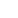
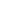

#  Custom Emoji
Custom emojis for OSRS.

## Getting Started

The plugin does not come with built-in emojis. You can either:
- Use the built-in GitHub downloader to fetch emoji packs directly (see [GitHub Integration](#-github-integration) below)
- Download an emoji starter pack from [the emoji repository](https://github.com/TheLouisHong/custom-emoji-repository/)

## Features

### Emoji
**The filename becomes the trigger for the emoji.** For example, `woow.png` means typing `woow` in-game will display that image.

- **Supported formats:** `.png`, `.jpg`, `.gif`
- **Location:** `.runelite/emojis/`
- **Auto-reload:** Changes are detected automatically - no restart needed

You can organize emoji in subfolders for easier management.

### Animated Emoji
GIF files are fully supported with frame-by-frame animation:
- Animations play in chat messages and above player heads
- Original GIF frame timing is preserved

### Soundoji (Sound Emoji)
**The filename becomes the trigger for the soundoji.** For example, `pipe.wav` means `pipe` in-game will play that audio file.

- **Supported formats:** `.wav`
- **Location:** `.runelite/soundojis/`
- **Volume:** Adjustable in plugin settings (0-100)

### Sidebar Panel
An explorer-style emoji browser in the RuneLite sidebar that allows the user to configure the settings for individual emoji:

#### Header Buttons:
-  **Settings** - Open plugin configuration
-  **Github** - Opens a browser page to this repository
-  **Folder** - Shows the `~/.runelite/emojis` folder in a file explorer window

#### Navigation Buttons:
-  **Back** - Navigates to to the previous directory
-  **Refresh** - Refresh the panel
-  **Download** - Fetch GitHub emoji pack
-  **Resize mode** - Toggle resize configuration mode

###  GitHub Integration
Download emoji packs directly from GitHub repositories:

1. Open plugin settings 
2. Enter a repository in the **Repository** field using format: `owner/repo` or `owner/repo/tree/branch`
3. Emoji are automatically downloaded and saved to `.runelite/emojis/github-pack/`

Click the  download button in the sidebar panel to manually check for updates. The plugin tracks file changes and will sync additions, modifications, and deletions.

**Note:** Local emoji take priority over GitHub pack emoji. If you have a local emoji with the same trigger name, it will be used instead of the downloaded one.

### Suggestion Overlay
While typing in chat, a overlay shows matching emoji based on what you're typing:
- Matching is case-insensitive
- Shows emoji previews with trigger names
- Configurable max suggestions (default: 10)
- Can be toggled in settings

### Tooltips
Hover over any emoji in chat to see its trigger name in a tooltip. Can be toggled in settings.

### Dynamic Chat Spacing
Automatically adjusts line spacing to accommodate tall emoji and prevent overlap on wrapped lines. Can be combined with manual spacing adjustment.

## Configuration

| Setting | Default | Description |
|---------|---------|-------------|
| Max Emoji Height | 24px | Maximum height for resized emoji |
| Show Suggestion Overlay | On | Show emoji suggestions while typing |
| Max Suggestions | 10 | Number of suggestions to display |
| Show Emoji Tooltips | On | Show trigger name on hover |
| Enable Animated Emojis | On | Render GIF animations |
| Show Emoji Panel | On | Show sidebar panel |
| Soundoji Volume | 70 | Audio volume (0-100) |
| Chat Message Spacing | 0 | Extra pixels between chat lines |
| Dynamic Emoji Spacing | On | Auto-adjust spacing for tall emoji |
| Repository | (empty) | GitHub repo for emoji downloads |

## Commands

| Command | Description |
|---------|-------------|
| `::emojifolder` | Open the emoji folder |
| `::soundojifolder` | Open the soundoji folder |
| `::emojierror` | Show emoji loading errors |
| `::emojiprint` | Show all loaded emoji |

## Troubleshooting

**My emoji appears blank/invisible. Pls fix?**
Some PNG files are encoded in ways that Java cannot read correctly. Re-save the image using any image editor (Paint, GIMP, Photoshop, etc.) or an online PNG converter and try again.

**My emoji failed to load. What the frick?**
If you're seeing the   error icon in the panel, try hitting the  refresh button. Otherwise, type `::emojierror` in game to see the error messages.

**Why do my animated emoji look like they're getting Thanos'd?**
OSRS has trouble rendering gifs that have optimizations applied to them. To be sure that every animated gif will work, you must ensure that any gifs have their frames coalesced (remove all optimizations) before using them. If you're using a github repo for your emoji distribution like I am, feel free to look at and steal my [github action](https://github.com/cman85/mooncord-emojis/blob/ratbranch/.github/workflows/coalesce-gifs.yml) for an example of something that will automatically handle the coalescing bit for you.

**Will you implement autofill/autocomplete?**
[No.](https://github.com/runelite/runelite/wiki/Rejected-or-Rolled-Back-Features#not-currently-being-considered)

If you need help, feel free to [open an issue](https://github.com/TheLouisHong/runelite-custom-emoji/issues/new).

## Credits
- [LouisGameDev](https://github.com/LouisGameDev/runelite-custom-emoji)
- [io-dream](https://github.com/io-dream)
- [cman85](https://github.com/cman8)
- [Fiffers](https://github.com/Fiffers)

## Attributions
- Icons from [Bootstrap Icons](https://icons.getbootstrap.com/) (MIT License)
